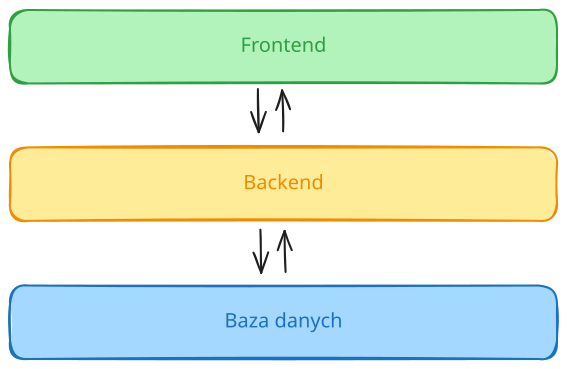
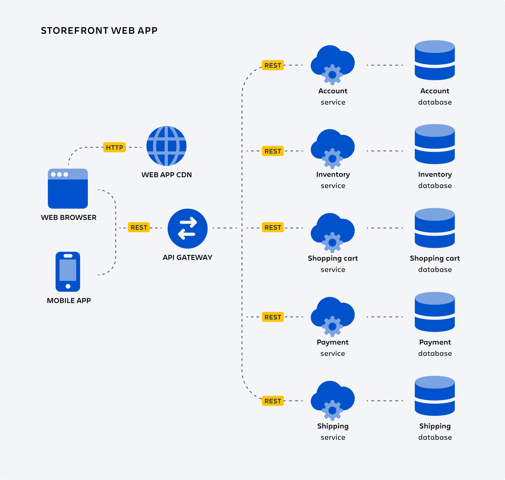
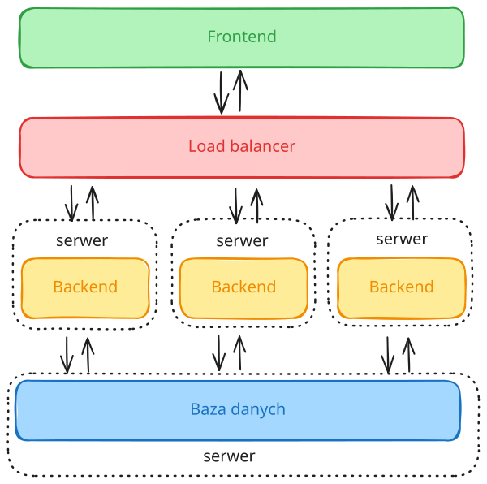
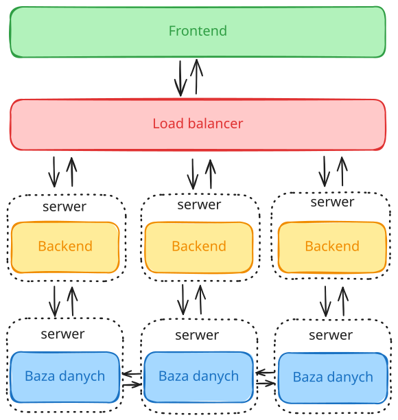
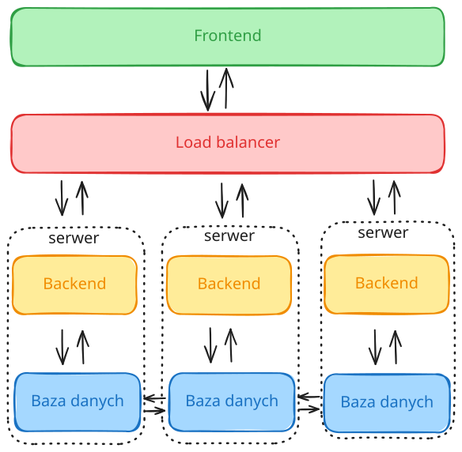
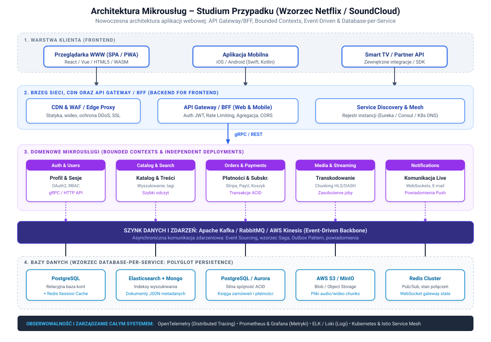
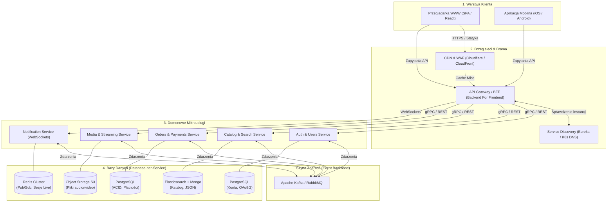

# Aplikacje WWW. Wykład #1

## 1. Czym jest aplikacja WWW/webowa/internetowa?

**Jest to aplikacja uruchamiana na serwerze, a dostęp do niej odbywa się przez przeglądarkę internetową bez konieczności instalacji na urządzeniu użytkownika.**

Aplikacją nazwiemy rozwiązanie, które wychodzi poza schemat klasycznej statycznej strony internetowej. Aplikacja dostarcza pewnej funkcjonalności, która poprzez technologie frontendowe pozwala na realizację pewnych zadań, które często były do tej pory realizowane poprzez aplikacje natywne.

Mogą to być aplikacje klasy CRM, portale społecznościowe z elementami komunikatorów, gry online, edytory tekstu, arkusze, klient e-mail i wiele innych.

> **Kilka wybranych cech aplikacji www:**
* uruchamiana na serwerze,
* architektura klient (przeglądarka) - serwer (serwer www + serwer aplikacji)
* komunikacja typu żądanie - odpowiedź,
* wymaga zazwyczaj (dla pełnej funkcjonalności) nieprzerwanego dostępu do Internetu,

> **Zalety aplikacji webowych**

* brak konieczności instalacji na urządzeniu, ale przede wszystkim aktualizacji do nowszych wersji (aktualizacja odbywa się centralnie czyli na serwerze),
* potencjalnie mniejszy koszt wytworzenia dla wielu różnych urządzeń klienckich, zwłaszcza całej gamy urządzeń mobilnych,
* większa dostępność ze względu na niskie wymagania (przeglądarka) aplikacji,
* stosunkowo łatwa adaptacja użytkownika do nowej aplikacji ze względu na podobieństwo aplikacji www i powszechność korzystania z przeglądarek internetowych.

> **Wady aplikacji webowych**

* konieczność stałego dostępu do Internetu (o bolączkach można się przekonać zwłaszcza przy wypełnianiu i przesyłaniu rozległych formularzy), ale ta wada nie dotyczy aplikacji typu PWA (o nich za chwilę),
* ograniczone możliwości przechowywania danych z aplikacji lokalnie,
* potencjalnie mniejsza wydajność niektórych rozwiązań względem aplikacji natywnych,
* ograniczenia w dostępie do zasobów systemu operacyjnego i urządzeń lokalnych,
* konieczność dostosowania interfejsu do szerokiego spektrum urządzeń (wyświetlaczy) w ramach jednej aplikacji (brak aplikacji dedykowanych).

### A co z PWA (Progressive Web Applications)?

Aplikacje typu PWA, progresywne aplikacje webowe, są aplikacjami, które w pewnym stopniu łączą ze sobą cechy klasycznej aplikacji webowej oraz aplikacji natywnej.

> **Poniżej kilka z tych cech:**

* uruchamiane są w przeglądarce internetowej, ale wyglądają jakby były aplikacjami natywnymi,
* mogą być "zainstalowane" na urządzeniu klienckim (urządzenia mobilne, dekstop) i uruchamiane jak inne lokalne aplikacje bez konieczności wpisywania adresu w przeglądarce po raz kolejny,
* mogą pracować w trybie offline,
* wykorzystywane są znane już technologie takie jak HTML, CSS, JS,
* mogą korzystać z powiadomień push, systemu GPS, Bluetooth,
* nie wymagają tworzenia oddzielnych wersji dla różnych systemów operacyjnych,
* zawsze wykorzystują HTTPS.

## 2. Krótka historia aplikacji webowych.

> **rok 1989**

* Pierwsze propozycje projektu **World Wide Web** zaprezentowane przez **Tim'a Berners Lee** wewnątrz **CERN**.

> **rok 1990**
* w grudniu **Tim Berners-Lee** uruchomił pierwszy serwer WWW (CERN, Szwajcaria)

> **rok 1991**

* zostaje uruchominy **pierwszy serwer webowy** w laboratorium  Stanford Linear Accelerator Center (SLAC) w stanie California (maszyna NeXT) poza Europą.
* Powstaje pierwsza strona internetowa (autor: **Tim Berners Lee**)
* **Tim Berners Lee** ogłasza światu projekt **World Wide Web**.
* **Tim Berners Lee** przedstawia szkic **pierwszej wersji języka HTML**.
* powstaje **protokół HTTP** (v0.9), który posiada tylko metodę GET

> **rok 1993**

* CERN po namowach uwalnia WWW dla wszystkich (formalne zrzeczenie się praw majątkowych).
* Powstaje **HTML 1.0**.
* Światło dzienne ujrzała przyjazna użytkownikom przeglądarka NCSA Mosaic z interfejsem graficznym.
* Powstaje interfejs CGI (możliwość uruchamiania kodu np. C, Perl) w celu dynamicznego generowania odpowiedzi. Komunikacja odbywa sie poprzez protokół HTTP.

> **rok 1994**

* Powstaje serwis Yahoo!
* Pierwsza stabilna wersja języka Python została wydana.
* **Tim Berners Lee** ogłasza powstanie **World Wide Web Consortium (W3C)**
* Powstaje przeglądarka Netscape Navigator.

> **rok 1995**

* Pierwsze publiczne wydanie **PHP/FI** (Personal Home Page/Form Interpreter) w wersji 1.0, którego pierwsza nieoficjalna wersja powstała rok wcześniej za sprawą Rasmusa Lerdorfa.
* Powstała pierwsza wersja języka **JavaScript**. Twórcą jest **Brendan Eich**. (tu nieco więcej o historii JavaScript: https://www.w3schools.com/js/js_history.asp).
* Ogłoszona zostaje wersja 2.0 języka HTML.
* Powstaje przeglądarka Opera oraz Internet Explorer 1.0.
* Jeff Bezos uruchamian Amazon.com.

> **rok 1996**

* Firma Macromedia przejmuje technologię, którą nazwą później Macromedia Flash.
* powstaje **CSS (Cascading Style Sheets)**.
  
> **rok 1997**

* HTML 3.2.
* XML 1.0.
* XML-RPC.

> **rok 1998**

* Netscape przenosi swoją przeglądarkę do open source i powstaje Mozilla Organization (później Mozilla Foundation).
* CSS 2.0
* PHP 3.0
* Powstaje **Google**.

> **rok 1999**

* 24.12.1999 wychodzi wersja **HTML 4.01**.

> **rok 2000**

* powstaje zarys **Representational State Transfer (REST)** w pracy doktorskiej Roy'a Fielding'a.
* pęka bańka dotcomów.

> **rok 2001**

* 15.01.2001 - powstaje serwis **Wikipedia**.

> **rok 2002**

* Powstaje **AWS (Amazon Web Services)**.
* **JSON (JavaScript Object Notation)** zostaje zaprezentowany.

> **rok 2003**

* Przeglądarka **Safari** debiutuje.
* Powstaje **WordPress**.

> **rok 2004**

* Powstaje grupa **Web Hypertext Application Technology Working Group (WHATWG)** w opozycji do W3C i jej fokusowania się na rozwoju XHTML.
(Ian Hickson).
* Przeglądarka **Mozilla Firefox** debiutuje.
* Powstaje **Gmail**.

> **rok 2005**

* Debiutuje **Google Maps** oraz **YouTube**.
* Jesse James Garrett (z agencji Adaptive Path) ukuł termin AJAX i opisał go w w słynnym eseju **"Ajax: A New Approach to Web Applications"**.
* **Webkit (Apple)** przechodzi w open source.
* Million DOlar Homepage (sprawdźcie sami!).
* Ruby on rails debiutuje.

> **rok 2006**

* powstaje pierwsza wersja **jQuery**.
* na świecie jest już ponad 100 000 000 stron internetowych.

> **rok 2008**

* 960.gs Framework.
* Debiutuje **Github**.
* Powstaje pierwsza wersja **Google Chrome**.
* Flexible Web Design, które jest początkiem ruchu w kierunku Responsive Web Design (artykuł Ethan'a Marcotte'a z roku 2010), który znamy do dziś.
* Szkic standardu **HTML 5** zostaje przedstawiony światu.

> **rok 2009**

* Debiutuje **Node.js**.

> **rok 2010**

* Powstaje **AngularJS**.

> **rok 2011**

* Framework **Bootstrap** debiutuje.
* Pojawia się technologia **WebSockets**.

> **rok 2012**

* Powstaje pierwsza wersja **TypeScript**.

> **rok 2013**

* Pierwsza wersja **React.js** zostaje zaprezentowana.

> **rok 2014**

* Debiutuje **Vue.js**.
* Sieć WWW liczy już ponad 1 000 000 000 stron internetowych.
* Standard **HTML 5 doczekał się upgrade'u oraz rekomendacji W3C**.

  
> **rok 2015**

* Wpis na blogu niejakiego Alexa Russell'a daje początek koncepcji **PWA (Progressive Web Applications)**.
* Po raz pierwszy ogłoszono prace nad technologią **WebAssembly**.

> **rok 2017**

* Adobe ogłasza koniec technologii Flash.
* Opublikowano pierwszą wersję WebAssembly.

> **rok 2019**

* WebAssembly otrzymało rekomendację W3C (w 2021 otrzymało również nagrodę Programming Languages Software Award)

> **teraz**
* rozwiązania oparte o AI potrafią wytwarzać większość mniej (to kwestia czasu) skomplikowanego kodu aplikacji webowych (ale i nie tylko).

Bardziej kompletna lista osadzona na osi czasu jest dostępna pod adresem: https://thehistoryoftheweb.com/timeline/.

## 3. Architektura aplikacji webowych.

Aplikacja webowa (ale dotyczy to również szerszego zakresu aplikacji) składa się zazwyczaj z trzech warstw aplikacji:

* **warstwa prezentacji (ang. frontend)** - jest to część, która odpowiada za interakcję użytkownika z aplikacją poprzez interfejs graficzny. Główne technologie to HTML, CSS oraz JavaScript.

* **warstwa logiki biznesowej (ang. backend)** - jest warstwa znajdująca sie po stronie serwera, która zawiera reguły działania aplikacji. Odpowiada za obsługę komunikatów z frontendu, ich przetwarzaniu, komunikacji z bazą danych i przekazanie wyników do aplikacji klienckiej.

* **warstwa dostępu do danych (bazy danych)** - system przechowywania i dostępu do danych.

Aplikacje webowe możemy również podzielić ze względu na modele architektoniczne.

Poniżej kilka popularnych rozwiązań architektonicznych:

* **architektura trójwarstwowa** - architektura, której składowe zostały opisane powyżej czyli frontend, backend i baza danych.

  
**Rysunek 1** - Architektura trójwarstwowa aplikacji webowej.

* **architektura mikrousług** - to podejście składa się z wyodrębnionych usług (np. usługa uwierzytelniania, usługa pamięci podręcznej, itp.), które zazwyczaj odpowiadają za jedną funkcję biznesową aplikacji. Takie podejście umożliwia bardziej dynamiczne skalowanie poszczególnych usług w zależności od potrzeb (np. obciążenia) dzięki takim rozwiązaniom jak konteneryzacja.

  
**Rysunek 2** - Przykładowa architektura rozwiązania opartego o mikrousługi.

_źródło: https://atlassian.com_

* **architektura Web-Queue-Worker** - model wykorzystywany zazwyczaj w przypadku aplikacji, które obsługują długotrwałe i zasobożerne operacje, które tutaj realizowane są poprzez workera oraz kolejkę komunikatów.

* **architektura SPA (Single Page Application)** - aplikacja jednostronicowa (czasem nazywana jednoplikową, gdyż składa się z jednego pliku HTML), której zawartość jest przeładowywana z wykorzystaniem technologii AJAX i przypomina to pracę aplikacji natywnej.

**Monolit vs aplikacja oparta o mikrousługi**
---
### Aplikacja monolityczna

Aplikacja **monolityczna** charakteryzuje się samodzielnością działania (realizuje wszystkie usługi w ramach jednej aplikacji), chociaż może komunikować się z innymi systemamy zewnętrznymi. Składowe tej aplikacji są ze sobą znacznie sztywniej powiązane niż w przypadku aplikacji opartej o mikrousługi.

> **Główne zalety monolitu to:**

* **łatwiejsze wdrażanie i rozwój** - aplikacja stanowi jedną całość ułatwiając zarządzanie infrastrukturą oraz kodem,
* **mniejsze opóźnienia** - dzięki monolitycznej naturze nie ma konieczności komunikacji z wieloma usługami w celu obsługi żądania co skraca czas jego realizacji,
* **łatwiejsze testowanie** - podobnie jak przy zarzadzaniu kodem tak i tutaj rozproszona natura aplikacji powoduje konieczność przetestowania jej komponentów w rozproszonym środowisku,
* **niższe koszty infrastruktury** - ze względu na rozbudowaną architekturę mikrousług, jej konfiguracja może pociągnąć za sobą większe koszty infrastruktury w stosunku do monolitu.

> ‍**Główne wady monolitu to:**

* **kosztowne skalowanie** – konieczność skalowania całej aplikacji lub znacznej jej części w przypadku niewystarczającej wydajności,
* **problematyczna aktualizacja** – każda zmiana wymaga ponownego wdrożenia całości,
* **zmiany technologiczne** - zmiana technologii lub frameworka jest skomplikowana, ponieważ dotyka całego systemu,
* **potencjalne większe koszty awarii** - awaria aplikacji może powodować brak dostępu do całego systemu, co w przypadku mikrousług może zostać zredukowane poprzez większą redundancję poszczególnych jego składowych.

> **Skalowanie aplikacji monolitycznej**

Skalowanie aplikacji monolitycznej odbywa się najczęściej w pionie (scale-up), które polega na rozbudowie mocy obliczeniowej maszyny, na której jest ona uruchomiona, lub poprzez uruchomienie wielu kopii takiej aplikacji (scale-out), które zazwyczaj dotyczy warstwy backend lub bazodanowej.

Schematów skalowania jest co najmniej kilka. Przytoczę dwa poniżej.

**Skalowanie warstwy backend**

  
**Rysunek 3** - Przykład architektury systemu ze skalowaniem poziomym warstwy backend.

Tutaj mamy do czynienia ze skalowaniem tylko warstwy backend, która w porównaniu do warstwy frontend generuje zazwyczaj znaczne obciążenie dla serwera.
Takie rozwiązanie ma sens o ile tzw. "wąskim gardłem" całej aplikacji jest backend a nie baza danych.

**Skalowanie warstwy backend oraz warstwy bazy danych**

  
**Rysunek 4** - Przykład architektury systemu ze skalowaniem poziomym warstwy backend oraz warstwy danych.

  
**Rysunek 5** - Przykład architektury systemu ze skalowaniem poziomym z kolokacją backendu i bazy danych na pojedynczym serwerze.

Tu natomiast mamy do czynienia ze skalowaniem dwóch warstw - backendu oraz bazy danych. To rozwiązanie może być realizowane w kilku wariantach:
* serwer backend oraz oddzielny serwer bazy danych,
* serwer backend oraz bazy danych to jedna maszyna.

Oba te rozwiązania wymagają mechanizmu replikacji między serwerami bazy danych, który wprowadza dodatkową komplikację, ale i opóźnienie w dostępnie do danych.

**Skalowanie warstwy frontend**

Dzięki takim mechanizmom jak **pamięć podręczna (ang. cache)** można znacznie zredukować obciążenie serwera w kontekście serwowania **statycznej zawartości (pliki html, js, grafika, video)** co powoduje, że frontend podlega skalowaniu rzadziej. Często są tu wykorzystywane tzw. **CDN (Content Delivery Network)**, które dzięki replikacji zawartości statycznej pomiędzy wiele lokalizacji rozsianych na świecie pozwalają "skrócić drogę" tych danych do klienta co skutkuje skróceniem czasu pobrania danych oraz wprowadza redundancję danych.

### Aplikacja oparta o mikrousługi

Jak zostało już wspomniane aplikacja oparta o mikrousługi oferuje możliwość wyodrębnienia pewnych części systemu (aplikacji) do mniejszego komponentu (mikrousługi), która następnie może zostać osadzona w postaci lekkiego kontenera i zwielokrotniana jeżeli obciążenie systemu tego wymaga. To podejście umożliwia zwiększanie wydajności aplikacji w miejscach, które tego wymagają, a nie dla całej aplikacji. Może akurat potrzeba większej wydajności obsługi pamięci podręcznej, a nie systemu uwierzytelniania? 

Takie podejście wymaga oczywiście nieco więcej pracy niż w przypadku monolitu, gdyż należy wyodrębnić i zaprojektować te części aplikacji, które do takich mikrousług należy migrować.

> **Zalety aplikacji opartych o mikrousługi:**

* **łatwość skalowania** - jak już mikrousługi zostaną wyodrębnione i osadzone w postaci kontenerów w odpowiednim systemie ich orkiestracji to skalowanie można nawet zupełnie zautomatyzować określając pewne reguły tworzenia lub terminacji kolejnych instancji kontenerów,
* **aktualizacja technologiczna** - wprowadzenie zmian w ramach jednej usługi nie musi nieść za sobą konieczności zmian w innych częściach aplikacji,
* **elastyczność aktualizacji** - aktualizacje mogą być wdrażane stopniowo dla poszczególnych usług,
* **odporność na awarie** - dzięki redundancji oraz odpowiedniej konfiguracji awaria jednej usługi nie musi nieść za sobą niedostępności całej aplikacji,

> **Wady aplikacji opartych o mikrousługi:**

* **stopień skomplikowania** - takie aplikacje są zazwyczaj bardziej skomplikowane pod kątem architektury i wzajemnych powiązań i komunikacji między poszczególnymi usługami,
* **większe opóźnienia** - przez konieczność komunikacji między wieloma usługami opóźnienia mogą być większe niż w przypadku aplikacji monolitycznej,
* **koszty** - ze względu na większy stopień skomplikowania całej infrastruktury koszty wdrożenia oraz utrzymania takiej aplikacji mogą być wyższe, ale to zależy również tego czy skalowanie zostało odpowiednio zoptymalizowane względem podobnej wydajności aplikacji monolitycznej,
* **zarządzanie danymi** - problem synchronizacji danych między wieloma usługami może być dość skomplikowany do wdrożenia.

## 4. Studium Przypadku: Architektura Mikrousług w Nowoczesnych Aplikacjach WWW

> Przykład oparty o rzeczywiste doświadczenia inżynierskie twórców platform **SoundCloud** oraz **Netflix**, opublikowane na ich blogach technicznych.

---

### 4.1. Wprowadzenie: Poza schemat podręcznikowy

W podstawowej teorii architektury oprogramowania mikroserwisy bywają przedstawiane jako prosta grupa niezależnych „pudełek” połączonych strzałkami. W rzeczywistych aplikacjach webowych o dużej skali podział monolitu na mikrousługi rodzi natychmiast fundamentalne pytania:
* Jak połączyć dziesiątki usług z jedną przeglądarką użytkownika bez zapychania łącza setkami zapytań HTTP?
* Jak zarządzać autoryzacją i sesją użytkownika bez odpytywania bazy danych przy każdym kliknięciu?
* W jaki sposób utrzymać spójność danych, gdy każda usługa ma własną bazę danych?
* Co zrobić, gdy jedna z usług ulegnie awarii, aby cała strona nie przestała działać?

Poniższe studium przypadku prezentuje architekturę, która odpowiada na te pytania w oparciu o wzorce sprawdzone w boju przez czołowe firmy technologiczne.

---

### 4.2. Geneza z rynku: SoundCloud i narodziny wzorca BFF

Świetnym przykładem ewolucji od klasycznej aplikacji webowej do mikrousług jest historia platformy **SoundCloud** (opisana m.in. przez Phila Calçado na blogu technicznym SoundCloud oraz u Martina Fowlera):

1. **Początek (Monolit „Mothership”)**:  
   SoundCloud wystartował jako klasyczna, monolityczna aplikacja w języku Ruby on Rails z jedną bazą danych MySQL.
2. **Kryzys wzrostu**:  
   Gdy serwis zyskał miliony użytkowników, wprowadzono rozbudowane mechanizmy odtwarzania w locie, komentarze osadzane bezpośrednio na fali dźwiękowej, system społecznościowy oraz natywne aplikacje mobilne (iOS i Android).
   * Monolit stał się wąskim gardłem: każde wdrożenie niosło ryzyko awarii całego serwisu.
   * Narastał dług technologiczny, a czas budowania i testowania aplikacji paraliżował pracę zespołów programistycznych.
3. **Migracja do mikrousług i problem uniwersalnego API**:  
   Podzielono monolit na mniejsze serwisy (katalog, autoryzacja, strumieniowanie, profil). Szybko jednak okazało się, że udostępnienie pojedynczego, ogólnego API Gateway dla wszystkich klientów rodzi kolejny problem:
   * **Przeglądarka internetowa (Web SPA)** potrzebowała bogatych, zagregowanych danych do wyrenderowania całego pulpitu w jednym zapytaniu.
   * **Aplikacje mobilne** potrzebowały odchudzonych pakietów danych ze względu na ograniczone pakiety komórkowe i mniejsze ekrany.
4. **Rozwiązanie – Wzorzec BFF (Backend For Frontend)**:  
   Inżynierowie SoundCloud stworzyli oddzielne warstwy pośredniczące dla każdego typu klienta (dedykowany backend dla aplikacji Web oraz dedykowany dla aplikacji Mobile). Wzorzec ten stał się dziś standardem branżowym w inżynierii webowej.

---

### 4.3. Schemat Architektury

Poniższy diagram przedstawia pełny przepływ danych w nowoczesnej architekturze mikrousług dla aplikacji webowej:

#### Diagram relacji (Mermaid)

```mermaid
flowchart TD
    subgraph Klienci["1. Warstwa Klienta"]
        Web["Przeglądarka WWW (SPA / React)"]
        Mobile["Aplikacja Mobilna (iOS / Android)"]
    end

    subgraph Brzeg["2. Brzeg sieci & Brama"]
        CDN["CDN & WAF (Cloudflare / CloudFront)"]
        BFF["API Gateway / BFF (Backend For Frontend)"]
        Discovery["Service Discovery (Eureka / K8s DNS)"]
    end

    subgraph Uslugi["3. Domenowe Mikrousługi"]
        Auth["Auth & Users Service"]
        Catalog["Catalog & Search Service"]
        Order["Orders & Payments Service"]
        Stream["Media & Streaming Service"]
        Notify["Notification Service (WebSockets)"]
    end

    subgraph Szyna["Szyna Zdarzeń (Event Backbone)"]
        Kafka["Apache Kafka / RabbitMQ"]
    end

    subgraph Bazy["4. Bazy Danych (Database-per-Service)"]
        DB_Auth[("PostgreSQL\n(Konta, OAuth2)")]
        DB_Cat[("Elasticsearch + Mongo\n(Katalog, JSON)")]
        DB_Order[("PostgreSQL\n(ACID, Płatności)")]
        DB_Media[("Object Storage S3\n(Pliki audio/wideo)")]
        DB_Notify[("Redis Cluster\n(Pub/Sub, Sesje Live)")]
    end

    Web -->|HTTPS / Statyka| CDN
    Web -->|Zapytania API| BFF
    Mobile -->|Zapytania API| BFF
    CDN -.->|Cache Miss| BFF

    BFF <-->|Sprawdzenie instancji| Discovery
    BFF -->|gRPC / REST| Auth
    BFF -->|gRPC / REST| Catalog
    BFF -->|gRPC / REST| Order
    BFF -->|gRPC / REST| Stream
    BFF -->|WebSockets| Notify

    Auth <-->|Zdarzenia| Kafka
    Catalog <-->|Zdarzenia| Kafka
    Order <-->|Zdarzenia| Kafka
    Stream <-->|Zdarzenia| Kafka
    Notify <-->|Zdarzenia| Kafka

    Auth --- DB_Auth
    Catalog --- DB_Cat
    Order --- DB_Order
    Stream --- DB_Media
    Notify --- DB_Notify
```

---

### 4.4. Szczegółowe omówienie poszczególnych warstw

#### Warstwa 1: Klienci (Frontend)
Aplikacja frontendowa (np. zbudowana w technologiach React, Vue, Angular lub jako PWA) nie komunikuje się bezpośrednio z poszczególnymi mikrousługami. Z punktu widzenia przeglądarki cały backend widoczny jest pod jedną domeną (np. `api.twojadomena.pl`), co rozwiązuje problemy z polityką CORS (*Cross-Origin Resource Sharing*) oraz upraszcza zarządzanie ciasteczkami sesyjnymi.

#### Warstwa 2: Brzeg sieci, CDN oraz API Gateway / BFF
1. **CDN (Content Delivery Network) i WAF**:
   * Zdecydowana większość transferu w aplikacjach WWW (pliki HTML, bundle JavaScript, arkusze CSS, grafiki, zwiastuny wideo) w ogóle **nie trafia do mikrousług**. Jest buforowana na serwerach brzegowych (Cloudflare, AWS CloudFront, Fastly).
   * WAF (*Web Application Firewall*) filtruje ataki DDoS, próby SQL Injection oraz ataki typu brute-force.
2. **API Gateway / Wzorzec BFF (Backend For Frontend)**:
   * **Terminacja SSL/TLS** i zarządzanie certyfikatami.
   * **Weryfikacja autoryzacji**: Brama sprawdza podpis tokenu JWT użytkownika raz na brzegu. Do wewnętrznych mikroserwisów przekazuje już zweryfikowany kontekst użytkownika w nagłówkach HTTP (np. `X-User-Id: 12345`, `X-User-Role: premium`), zdejmując z nich narzut powtarzalnej weryfikacji.
   * **Agregacja zapytań (*API Composition*)**: Aby wyrenderować stronę główną, przeglądarka musiałaby odpytać 5 różnych serwisów. BFF robi to równolegle wewnątrz szybkiej sieci lokalnej (np. po protokole gRPC) i zwraca do przeglądarki jeden spójny dokument JSON.
   * **Rate Limiting**: Ochrona przed nadmierną liczbą zapytań z jednego adresu IP/konta.

#### Warstwa 3: Domenowe Mikrousługi (Bounded Contexts)
Każda usługa odpowiada za ściśle wydzielony obszar biznesowy zgodnie z zasadami **DDD (Domain-Driven Design)**:
* **Auth & Users Service**: Zarządza profilami, rejestracją, logowaniem, odświeżaniem tokenów (Refresh Token) i rolami.
* **Catalog & Search Service**: Udostępnia dane o treściach (np. albumach, utworach, filmach, artykułach). Charakteryzuje się ogromną przewagą odczytów nad zapisami (*Read-Heavy*).
* **Orders & Payments Service**: Odpowiada za transakcje finansowe, subskrypcje i koszyk. Wymaga bezwzględnej spójności transakcyjnej (ACID).
* **Media & Streaming Service**: Obsługuje procesy długotrwałe (transkodowanie plików wideo do formatów adaptacyjnych HLS/DASH, generowanie fali dźwiękowej, przetwarzanie miniatur). Realizowane w modelu *Worker Queue*.
* **Notification Service**: Utrzymuje stałe, dwukierunkowe połączenia z przeglądarkami przez **WebSockets** lub **Server-Sent Events (SSE)**, wysyłając natychmiastowe powiadomienia (np. o zakończeniu przetwarzania pliku lub nowej wiadomości).

#### Warstwa 4: Asynchroniczna Szyna Zdarzeń (Apache Kafka / RabbitMQ)
W architekturze mikrousług kluczowe jest unikanie kaskadowych wywołań synchronicznych (tzw. *Distributed Monolith Anti-Pattern*). Jeśli serwis płatności przy każdym zamówieniu synchronicznie wołałby serwis mailowy, magazynowy i statystyk – awaria dowolnego z nich wyłożyłaby cały proces zakupu.

Zamiast tego stosuje się **architekturę sterowaną zdarzeniami (Event-Driven Architecture)**:
1. Użytkownik opłaca zamówienie w `Orders Service`.
2. `Orders Service` zapisuje transakcję w swojej bazie i rzuca na szynę Kafki zdarzenie: `OrderPlaced { orderId: 789, userId: 123 }`.
3. Inne serwisy nasłuchują na ten temat (*topic*) asynchronicznie:
   * `Notification Service` odbiera zdarzenie i wysyła e-mail oraz push do przeglądarki.
   * `Analytics Service` rejestruje konwersję w hurtowni danych.
   * `Media Service` odblokowuje dostęp do zasobu premium.

#### Warstwa 5: Bazy Danych (Zasada *Database-per-Service*)
Kardynalna zasada mikrousług brzmi: **żadna mikrousługa nie ma prawa bezpośrednio dotykać bazy danych innej mikrousługi**. Komunikacja z danymi odbywa się wyłącznie przez publiczne interfejsy API.

Dzięki temu zyskujemy **Polyglot Persistence** (dobór bazy idealnie dopasowanej do zadania):
* **Relacyjna baza SQL (np. PostgreSQL)** dla zamówień i kont (wymóg transakcji ACID, brak anomalii finansowych).
* **Silnik wyszukiwania (Elasticsearch)** dla katalogu treści (błyskawiczne wyszukiwanie pełnotekstowe, autouzupełnianie, filtry fasetowe).
* **Magazyn obiektowy (AWS S3 / MinIO)** dla ciężkich plików multimedialnych.
* **Pamięć In-Memory (Redis)** dla sesji, limitów zapytań i dystrybucji komunikatów WebSocket.

---

### 4.5. Kluczowe Wzorce Odpornościowe (Resilience Patterns)

W systemie rozproszonym **awaria jest stanem normalnym** (zgodnie z powiedzeniem Wernera Vogelsa, CTO Amazona: *„Everything fails, all the time”*). Nowoczesna architektura mikrousług musi zawierać:

1. **Circuit Breaker (Bezpiecznik – np. Resilience4j / dawniej Netflix Hystrix)**:
   * Jeśli serwis rekomendacji zaczyna odpowiadać ze zbyt dużym opóźnieniem lub zwraca błędy 500, bezpiecznik „otwiera się” i odcina ruch do tego serwisu.
   * Zamiast czekać na timeout i zawieszać wątki serwera API, brama natychmiast zwraca odpowiedź zapasową (**Fallback**), np. listę 10 najpopularniejszych pozycji zamiast spersonalizowanych rekomendacji.
   * Użytkownik przeglądarki widzi działającą stronę, nie wiedząc nawet, że podsystem rekomendacji ma awarię.
2. **Wzorzec Saga (Zamiast transakcji rozproszonych)**:
   * Tradycyjne transakcje dwufazowe (2PC) w chmurze są zbyt wolne i blokujące.
   * Transakcję biznesową realizuje się jako sekwencję lokalnych transakcji koordynowanych zdarzeniami. W razie błędu na którymś etapie wyzwalane są tzw. **transakcje kompensujące** (odwracające skutki wcześniejszych kroków, np. zwrot pobranych środków z karty).
3. **Obserwowalność (Observability) i Distributed Tracing**:
   * Każde zapytanie wpadające do bramy otrzymuje unikalny identyfikator śledzenia (np. `Trace-Id: 9f8a-4b2c`).
   * Identyfikator ten jest przekazywany w nagłówkach do każdego kolejnego mikroserwisu.
   * Dzięki narzędziom takim jak **OpenTelemetry**, **Jaeger** czy **Zipkin**, inżynier może otworzyć jeden wykres i zobaczyć dokładny czas wykonania każdego podzapytania w 10 różnych mikroserwisach biorących udział w obsłudze jednego kliknięcia użytkownika.

---

### 4.6. Kiedy mikrousługi to błąd? („Podatek od mikrousług”)

Wykład akademicki musi uczyć krytycznego myślenia inżynierskiego. Mikrousługi nie są uniwersalnym „lepszym monolitem” – wprowadzają potężny narzut:

| Aspekt | Monolit | Mikrousługi |
| :--- | :--- | :--- |
| **Opóźnienia sieciowe** | Wywołania w pamięci RAM (nanosekundy) | Wywołania po sieci HTTP/gRPC (milisekundy) |
| **Spójność danych** | Natychmiastowa (ACID w jednej bazie) | Spójność ostateczna (*Eventual Consistency*) |
| **Wdrażanie i lokalne uruchomienie** | `git pull` & `docker compose up` | Konieczność orkiestracji kontenerów (Kubernetes) |
| **Testowanie** | Proste testy integracyjne w jednym procesie | Skomplikowane testy kontraktowe (np. Pact) |
| **Zarządzanie zespołem** | Jeden zespół może rozwijać całość | Wymaga dojrzałych zespołów zgodnych z **Prawem Conwaya** |

> **Podsumowanie architektoniczne:**  
> Jeśli zespół liczy kilku programistów, a ruch mieści się na jednej lub dwóch maszynach, wybór mikrousług jest najczęściej błędem architektonicznym (*premature optimization*). Standardem rekomendowanym na start jest tzw. **Monolit Modułowy (Modular Monolith)** – dobrze zaprojektowany monolit z wyraźnymi granicami domenowymi w kodzie, z którego w razie potrzeby można bez trudu wyciąć pojedynczy mikroserwis (dokładnie tak, jak zaczynał Shopify czy SoundCloud).

---

### 4.7. Materiały źródłowe i literatura

1. **Phil Calçado (SoundCloud)**: *From Monolith to Microservices* – seria artykułów o rozbijaniu monolitu Mothership i wdrażaniu BFF: [philcalcado.com](https://philcalcado.com/)
2. **Martin Fowler**: *Backends For Frontends pattern*: [martinfowler.com/articles/bff.html](https://martinfowler.com/articles/bff.html)
3. **Netflix Technology Blog**: *A Design Analysis of Cloud-Optimized Web Applications* oraz materiały o bramie *Zuul* i odporności: [netflixtechblog.com](https://netflixtechblog.com/)
4. **Chris Richardson**: *Microservices Patterns: With examples in Java* (Manning Publications) – kompendium wzorców Database-per-service, Saga, CQRS i API Gateway.
5. **Sam Newman**: *Building Microservices: Designing Fine-Grained Systems* (O'Reilly).

## 5. Kilka ciekawostek.

1. Jak wygląda aktualnie udział przeglądarek internetowych w rynku? Sprawdź: [https://gs.statcounter.com/](https://gs.statcounter.com/)
2. Jaka technologia (oczywiście nie ma 100% pewności, że tylko te) została wykorzystana w danej stronie internetowej? Sprawdź: [https://builtwith.com/](https://builtwith.com/)
3. Które strony internetowe są najczęściej odwiedzanymi na świecie? A w Polsce? Sprawdź: [https://www.semrush.com/website/top/](https://www.semrush.com/website/top/) oraz [https://www.similarweb.com/top-websites/](https://www.similarweb.com/top-websites/)
4. Milion dolarów! Wspomniana wcześniej strona: [https://thehistoryoftheweb.com/the-power-of-the-pixel/](https://thehistoryoftheweb.com/the-power-of-the-pixel/) oraz nagroda za surfowanie po Internecie i wypełnianie formularzy: [https://thehistoryoftheweb.com/they-offered-a-million-dollars-to-surf-the-web-somebody-won/](https://thehistoryoftheweb.com/they-offered-a-million-dollars-to-surf-the-web-somebody-won/)
5. Inne spojrzenie na historię aplikacji webowych: [https://www.matthewgerstman.com/tech/history-of-the-web/](https://www.matthewgerstman.com/tech/history-of-the-web/)
6. Krótko o początkach całej historii prosto ze źródła: [https://home.cern/science/computing/birth-web/short-history-web](https://home.cern/science/computing/birth-web/short-history-web)
7. Ankieta Stack Overflow odnośnie technologii webowych: [https://survey.stackoverflow.co/2025/technology#1-web-frameworks-and-technologies](https://survey.stackoverflow.co/2025/technology#1-web-frameworks-and-technologies)
8. Nieco z innej beczki, ale warto wiedzieć skąd wziął się null pointer reference... [https://en.wikipedia.org/wiki/Null_pointer#History](https://en.wikipedia.org/wiki/Null_pointer#History)

_&copy; Krzysztof Ropiak, 2026_