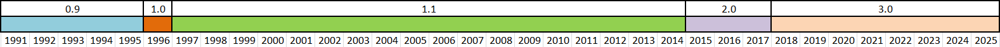

# Aplikacje WWW. Wykład #2


## 1. Protokół HTTP i HTTPS

Protokół **HTTP (ang. Hypertext Transfer Protocol)** został stworzony przez **Tima Berners-Lee** i służy on do komunikacji z serwerami WWW.  
Komunikacja obdywa się w modelu klient-serwer domyślnie na porcie numer 80. Klient (może to być przeglądarka internetowa, ale również inny serwer obsługujący protokół HTTP) wysyła żądanie (ang. request), a serwer wysyła odpowiedź (ang. response).  
To żądanie dotyczy konkretnego zasobu, którym może być plik graficzny, plik javascript czy HTML, a zazwyczaj tych zasobów jest wiele do wyświetlenia pojedynczej strony z Internetu. Te zasoby są identyfikowane poprzez URI (ang. Uniform Resource Identifier).  
Początkowo protokół ten był protokołem bezstanowycm (ang. stateless), ale poprzez mechanizm ciasteczek, sesji po stronie serwera oraz ukrytych parametrów (formularz, parametry w adresie URL) zostało to zmienione.

Protokół HTTP znajduje się w najwyższej warstwie modelu ISO/OSI, w warstwie aplikacji.


### Krótka historia najważniejszych zmian w protokole HTTP

**HTTP 0.9**

Pierwsza oficjalna wersja, która była wykorzystywana w pierwszym serwerze www.

Główne cechy protokołu w tej wersji:
* dostępne tylko żądanie typu GET,
* odpowiedź, która była zwracana zawsze była dokumentem HTML,
* brak nagłówka,
* brak kodów odpowiedzi,


**HTTP/1.0**

* dodano metody HEAD oraz POST, co umożliwiało komunikację dwustronną,
* pojawiły się kody statusów odpowiedzi (ang. response codes),
* dodano nagłówek, umożliwiając cashowanie, autoryzację i określenie różnych typów plików,

**HTTP/1.1**

W lipcu 1999 roku opublikowano oficjalną specyfikację protokolu HTTP w wersji 1.1.

Dokument RFC standardu HTTP/1.1: https://datatracker.ietf.org/doc/html/rfc2616

W tej wersji najważniejsze zmiany i usprawnienia to:
* pojawienie się kolejnych metod żądania, nagłówków,
* usprawniony mechanizm pamięci podręcznej,
* możliwość wysłania kolejnego żądania zanim poprzednie się zakończyło,
* umożliwienie negocjacji języka, typów danych, kodowania między klientem a serwerem,
* usprawniono mechanizm pobierania plików statycznych, który powodował, że nie musiały być za każdym razem pobierane z serwera.

Jest to najdłużej funkcjonująca do tej pory wersja protokołu HTTP.

**HTTP/2**

Za Wikipedią:
> "W 2009 roku Google ogłosił prace nad nowym protokołem mającym ulepszyć HTTP, a w 2010 upublicznił go jako SPDY. Gdy IETF na początku 2012 ogłosiło rozpoczęcie prac nad następcą HTTP, Google przedstawił protokół jako kandydata obok zgłoszonego przez Microsoft protokołu HTTP Speed+Mobility, także częściowo opartego na SPDY. Przy wsparciu Facebooka opublikowana w listopadzie 2012 roku specyfikacja SPDY stała się pierwszym szkicem nowego protokołu."

Oficjalnie specyfikacja została zatwierdzona w maju 2015 roku i została opublikowana w dokumencie [RFC 7540](https://datatracker.ietf.org/doc/html/rfc7540)

Najważniejsze zmiany w stosunku do wersji HTTP 1.1:
* **binarny format komunikacji i ramkowanie** - zmiana formatu tekstowego na binarny, co zwiększa wydajność oraz podział danych na mniejsze fragmenty - ramki,
* **wielowątkowość (ang. multiplex)** - możliwość przesłania wielu żądań i odpowiedzi na jednym połączeniu TCP,
* **kompresja nagłówków (HPACK)** - przyspieszenie wysyłania tych samych informacji zawartych w nagłówku,
* **server push** - serwer może wysłać do przeglądarki zasoby zanim ta ich zażąda,
* **priorytetyzacja zasobów** - możliwe jest ustalenie priorytetów dla zasobów, które maja zostać wysłane do przeglądarki wpływając na kolejność ich wysyłania,


**HTTP/3**

Protokół w ostatecznej wersji został opublikowany w dokumencie [RFC 9114](https://tools.ietf.org/html/rfc9114) w czerwcu 2022 roku, ale jego pierwsze wersje pojawiły się już w roku 2018 i były stopniowo wdrażane w popularnych przeglądarkach.

Najważniejsze zmiany w wersji 3 protokołu HTTP:
* zmiana protokołu transmisji z SPDY w wersji HTTP/2 na bazującego na UDP protokół QUIC,
* kompresja nagłówków algorytmem QPACK,
* zmiana protokołu uścisku ręki (ang. handshake protocol) z TCP + TLS na iQUIC,
* schemat HTTP (ang. scheme) - tylko HTTPS,
* rezygnacja z wcześniejszej implementacji priorytetyzacji, jednak HTTP/3 pozwala na wykorzystanie ramek priorytetowych.


**Historia wersji protokołu (obowiązywania najnowsej wersji) na osi czasu**




| Version   | Year introduced | Current status | Usage in August 2024 | Support in August 2024 |
|-----------|-----------------|----------------|----------------------|------------------------|
| HTTP/0.9  | 1991            | Obsolete       | 0                    | 100%                   |
| HTTP/1.0  | 1996            | Obsolete       | 0                    | 100%                   |
| HTTP/1.1  | 1997            | Standard       | 33.8%                | 100%                   |
| HTTP/2    | 2015            | Standard       | 35.3%                | 66.2%                  |
| HTTP/3    | 2022            | Standard       | 30.9%                | 30.9%                  |

_źródło: https://en.wikipedia.org/wiki/HTTP_

### **Budowa adresu URI**

```console
scheme : [// authority] path [? query] [# fragment]
# gdzie authority może mieć postać
scheme : [//[user[:password]@]host[:port]][/path][?query][#fragment]
```

**Scheme** jest wymagane i odnosi się do sposobu (np. protokołu) komunikacji do uzyskania dostępu do zasobu, np. `http`, `https`, `ftp`. Pełna lista znajduje się pod adresem https://www.iana.org/assignments/uri-schemes/uri-schemes.xhtml.

**Authority** jest opcjonalne, zawiera informacje o użytkowniku (userinfo), hoście (host) oraz porcie (port).  
**Userinfo** jest opcjonalne, zawiera nazwę użytkownika i opcjonalnie hasło w postaci zapisu `username:password`. Jest to opcja przestarzała i wycofana ze względów bezpieczeństwa. Jeżeli ta wartość jest podana do następnym znakiem jest `@`, które określa host.

**Host** określa albo zarejestrowaną nazwę hosta (w systemie DNS) lub adres IP. Adres IPv4 jest zapisywany w postaci dziesiętnej z kropkami a adres IPv6 umieszczamy w nawiasach `[]`.

**Port** jest opcjonalny i następuje po hoście i znaku `:`.

**Path** jest wymaganym komponentem składającym się z segmentów tej ścieżki, każdy oddzielony znakiem slash `/`. 

**Query** jest opcjonalną składową, która jest poprzedzana znakiem `?` jeżeli występuje. W ten sposób można przekazać wartości do serwera we wskazanym formacie.

**Fragment** jest opcjonalny i jeżeli obecny poprzedzany jest znakiem `#`.


### **Metody protokołu HTTP**

Najważniejsze metody protokołu HTTP wraz z krótkim opisem:

1. **GET**  
Służy do pobierania zasobów z serwera. Nie powinien modyfikować danych na serwerze. Parametry mogą być przekazywane w adresie URL.

1. **POST**  
Służy do przesyłania danych do serwera (np. formularze). Może powodować zmianę stanu na serwerze (np. dodanie rekordu do bazy).

1. **PUT**  
Służy do przesyłania danych i zastąpienia istniejącego zasobu nowym. Jeśli zasób nie istnieje, może go utworzyć.

1. **DELETE**  
Służy do usuwania wskazanego zasobu na serwerze.

1. **HEAD**  
Działa jak metoda GET, ale zwraca tylko nagłówki odpowiedzi, bez treści zasobu.

1. **OPTIONS**  
Pozwala sprawdzić, jakie metody są dostępne dla danego zasobu na serwerze.

1. **PATCH**  
Służy do częściowej modyfikacji zasobu (zmienia tylko wskazane fragmenty).

1. **TRACE**  
Służy do diagnostyki – zwraca żądanie otrzymane przez serwer, pozwalając śledzić trasę żądania.

1. **CONNECT**  
Umożliwia nawiązanie tunelu TCP, najczęściej używana do połączeń HTTPS przez proxy.

Najczęściej używane w aplikacjach WWW są: GET, POST, PUT, DELETE, PATCH. Pozostałe mają zastosowania specjalistyczne lub diagnostyczne.

Dość dobrze opisane i zaprezentowane kody odpowiedzi protokołu HTTP znajdziemy pod adresem https://developer.mozilla.org/en-US/docs/Web/HTTP/Reference/Status.

**Przykład żądania typu GET i odpowiedzi serwera**

```
curl -v https://github.com/kropiak
* Host github.com:443 was resolved.
* IPv6: (none)
* IPv4: 140.82.121.4
*   Trying 140.82.121.4:443...
* schannel: disabled automatic use of client certificate
* ALPN: curl offers http/1.1
* ALPN: server accepted http/1.1
* Connected to github.com (140.82.121.4) port 443
* using HTTP/1.x
# początek żądania
> GET /kropiak HTTP/1.1
> Host: github.com
> User-Agent: curl/8.13.0
> Accept: */*
>
# koniec żądania
# początek odpowiedzi
* Request completely sent off
< HTTP/1.1 200 OK
< Date: Thu, 09 Oct 2025 15:24:26 GMT
< Content-Type: text/html; charset=utf-8
< Vary: X-PJAX, X-PJAX-Container, Turbo-Visit, Turbo-Frame, X-Requested-With,Accept-Encoding, Accept, X-Requested-With
< ETag: W/"4d973abd985a61cf7a9706f05e3c7e31"
< Cache-Control: max-age=0, private, must-revalidate
< Strict-Transport-Security: max-age=31536000; includeSubdomains; preload
< X-Frame-Options: deny
< X-Content-Type-Options: nosniff
< X-XSS-Protection: 0
< Referrer-Policy: origin-when-cross-origin, strict-origin-when-cross-origin
< Content-Security-Policy: default-src 'none'; base-uri 'self'; child-src github.githubassets.com github.com/assets-cdn/worker/ github.com/assets/ gist.github.com/assets-cdn/worker/; connect-src 'self' uploads.github.com www.githubstatus.com collector.github.com raw.githubusercontent.com api.github.com github-cloud.s3.amazonaws.com github-production-repository-file-5c1aeb.s3.amazonaws.com github-production-upload-manifest-file-7fdce7.s3.amazonaws.com github-production-user-asset-6210df.s3.amazonaws.com *.rel.tunnels.api.visualstudio.com wss://*.rel.tunnels.api.visualstudio.com github.githubassets.com objects-origin.githubusercontent.com copilot-proxy.githubusercontent.com proxy.individual.githubcopilot.com proxy.business.githubcopilot.com proxy.enterprise.githubcopilot.com *.actions.githubusercontent.com wss://*.actions.githubusercontent.com productionresultssa0.blob.core.windows.net/ productionresultssa1.blob.core.windows.net/ productionresultssa2.blob.core.windows.net/ productionresultssa3.blob.core.windows.net/ productionresultssa4.blob.core.windows.net/ productionresultssa5.blob.core.windows.net/ productionresultssa6.blob.core.windows.net/ productionresultssa7.blob.core.windows.net/ productionresultssa8.blob.core.windows.net/ productionresultssa9.blob.core.windows.net/ productionresultssa10.blob.core.windows.net/ productionresultssa11.blob.core.windows.net/ productionresultssa12.blob.core.windows.net/ productionresultssa13.blob.core.windows.net/ productionresultssa14.blob.core.windows.net/ productionresultssa15.blob.core.windows.net/ productionresultssa16.blob.core.windows.net/ productionresultssa17.blob.core.windows.net/ productionresultssa18.blob.core.windows.net/ productionresultssa19.blob.core.windows.net/ github-production-repository-image-32fea6.s3.amazonaws.com github-production-release-asset-2e65be.s3.amazonaws.com insights.github.com wss://alive.github.com wss://alive-staging.github.com api.githubcopilot.com api.individual.githubcopilot.com api.business.githubcopilot.com api.enterprise.githubcopilot.com; font-src github.githubassets.com; form-action 'self' github.com gist.github.com copilot-workspace.githubnext.com objects-origin.githubusercontent.com; frame-ancestors 'none'; frame-src viewscreen.githubusercontent.com notebooks.githubusercontent.com; img-src 'self' data: blob: github.githubassets.com media.githubusercontent.com camo.githubusercontent.com identicons.github.com avatars.githubusercontent.com private-avatars.githubusercontent.com github-cloud.s3.amazonaws.com objects.githubusercontent.com release-assets.githubusercontent.com secured-user-images.githubusercontent.com/ user-images.githubusercontent.com/ private-user-images.githubusercontent.com opengraph.githubassets.com marketplace-screenshots.githubusercontent.com/ copilotprodattachments.blob.core.windows.net/github-production-copilot-attachments/ github-production-user-asset-6210df.s3.amazonaws.com customer-stories-feed.github.com spotlights-feed.github.com objects-origin.githubusercontent.com *.githubusercontent.com; manifest-src 'self'; media-src github.com user-images.githubusercontent.com/ secured-user-images.githubusercontent.com/ private-user-images.githubusercontent.com github-production-user-asset-6210df.s3.amazonaws.com gist.github.com; script-src github.githubassets.com; style-src 'unsafe-inline' github.githubassets.com; upgrade-insecure-requests; worker-src github.githubassets.com github.com/assets-cdn/worker/ github.com/assets/ gist.github.com/assets-cdn/worker/
< Server: github.com
< Accept-Ranges: bytes
... (część z ciasteczkami obcięta)
< Set-Cookie: logged_in=no; Path=/; Domain=github.com; Expires=Fri, 09 Oct 2026 15:24:25 GMT; HttpOnly; Secure; SameSite=Lax
< X-GitHub-Request-Id: 1BB0:7B865:2AFA556:22CE34C:68E7D3A9
< Transfer-Encoding: chunked
<


<!DOCTYPE html>
<html
  lang="en"
(dalsza część HTML obcięta)
# koniec odpowiedzi
```


Żądanie składa się tu z kolejnych elementów:
* najpier rozwiązanie adresu serwera github.com przez system DNS, a następnie negocjacja wersji protokołu HTTP do zestawienia komunikacji,
* rodzaj żądania (tu GET) oraz path (już bez adresu serwera) oraz wersja protokołu,
* host
* nazwa klienta
* akceptacja dowolnego typu danych (mime type)
* pusta linia oddzielająca nagłówek od ciała żądania (tu ciała brak)

Po wysłaniu żądania (w curls domyślnie jest to żądanie typu GET) otrzymujemy odpowiedź gdzie:
* pierwsza linia to wersja protokołu oraz status odpowiedzi,
* dalej mamy wiersze zawierające nagłówki,
* pusta linia oznaczająca koniec nagłówków,
* ciało wiadomości jeżeli istnieje


### HTTPS

HTTPS (ang. Hypertext Transfer Protocol Secure) - to HTTP chroniony poprzez szyfrowanie protokołem TLS (wcześniej SSL) funkcjonujący również pod nazwą HTTPS Over TLS. Szyfrowanie odbywa się end to end, co zmniejsza jego podatność na ataki różnego typu. Domyślnie nasłuchiwanie odbywa się na porcie 443.

Od wersji protokołu HTTP/2 ze względu na sposób jego implementacji w silnikach przeglądarek internetowych jest on właściwie obligatoryjny. Wcześniej był opcjonalnie wykorzystywany. Obecnie około 80% stron na świecie domyślnie wykorzystuje protokół HTTPS.

## 2. Modele w frameworku Django.

Modele są sercem aplikacji, gdyż pozwalają na modelowanie encji oraz wymagań aplikacji w postaci struktur danych, które posiadają zarówno cechy jak i zachowania.

Oficjalna dokumentacja modeli Django znajduje się pod adresem: https://docs.djangoproject.com/en/5.2/topics/db/models/


## 3. Materiały i ciekawostki

1. HTTP everywhere! -> https://http.dev/
2. CURL IT! - > https://everything.curl.dev/
3. Jedno z najlepszych źródeł wiedzy o technologiach webowych. - > https://developer.mozilla.org/en-US/docs/Web/HTTP
4. Ciekaw/-a popularności różnych technologii webowych? -> https://w3techs.com/

**Ciekawostka 1 - pierwsze zdjęcie w Internecie**  
Pierwsze zdjęcie w Internecie: Jest to okładka albumu zespołu "Les Horribles Cernettes" z 1992 roku, opublikowana przez pracownice CERNu.

**Ciekawostka 2 - klucze do Internetu**  
https://tech.wp.pl/7-osob-kontroluje-internet-jaki-znamy,6051079050544257a

**Ciekawostka 3**  

**:-)**

To pierwsza emotikona przesłana przez Internet w 1982 roku przez jej twórcę, Scotta Fallmana.

**Ciekawostka 4**  
Pierwsza w historii strona internetowa jest wciąż aktywna: https://info.cern.ch/hypertext/WWW/TheProject.html

**Ciekawostka 5**  
Między 16 a 20% wyszukiwanych każdego dnia haseł w Google nigdy wcześniej nie było wyszukiwanych w dokładnie takiej postaci.